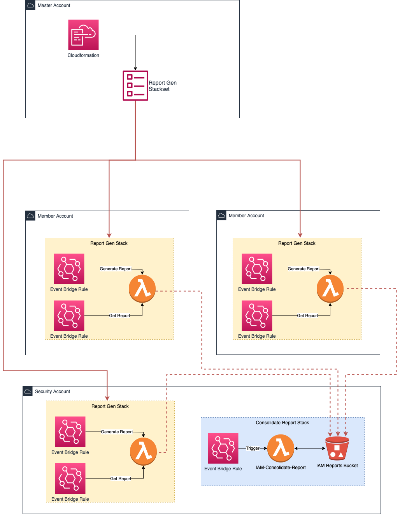

# AWS IAM Credential Report

Generate IAM Credential Reports from all your AWS managed accounts.

## Solution Diagram

## Instructions (EN-US)

1. Deploy the Cloudformation Template located in `stack/template.yml` in the AWS Account where you wish to store the generated IAM Credential Reports.

2. Deploy the Cloudformation Template located in `stackset/template.yaml` as a Cloudformation Stackset in the Management or Delegated Administrator account on your AWS Organizations setup.

3. (Optional) If you wish to also gather IAM Credential Reports from your Master Account, deploy the stack `stackset/template.yml` as a regular Cloudformation Template in the Master Account.

## Instruções (PT-BR)

1. Faça o deploy do template Cloudformation localizado em `stack/template.yml` na conta AWS onde você deseja armazenar os relatórios de credenciais do IAM.

2. Faça o deploy do template Cloudformation localizado em `stackset/template.yml` como um Cloudformation Stackset na conta de Gerenciamento ou Administrador Delegado na sua configuração do AWS Organizations.

3. (Opcional) Se você deseja também obter relatórios de credenciais do IAM da sua conta Mestre, faça o deploy do template localizada em `stackset/template.yml` como um stack normal na conta Master.
